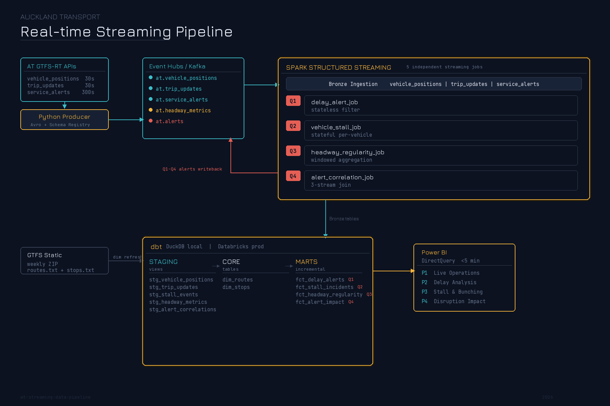
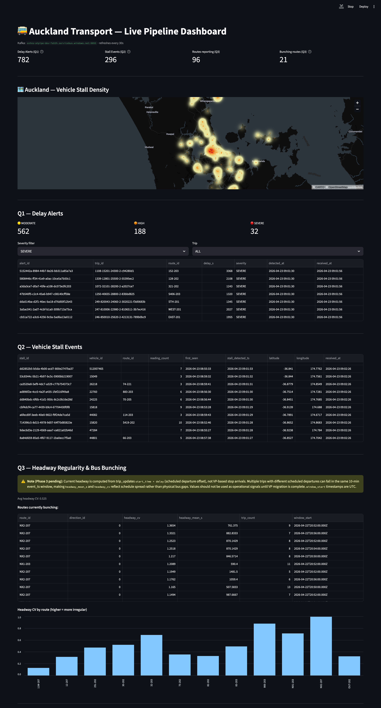

# Auckland Transport Real-time Streaming Pipeline


A streaming-first data pipeline that ingests Auckland Transport GTFS-Realtime data, detects operational anomalies in real time using Spark Structured Streaming, and builds historical analytics with dbt.

**Why streaming?** AT's GTFS-RT feeds update every 30 seconds. A delay alert delivered 10 minutes late is useless to passengers waiting at the stop; a stalled bus needs dispatch now, not in tomorrow's report. The data naturally demands streaming — this isn't batch ETL with a "streaming" label.

### Project Status

| Component                                   | Status  |
| ------------------------------------------- | ------- |
| Kafka producer (adaptive polling + Avro)    | Done    |
| Spark Bronze ingestion                      | Done    |
| Spark Q1-Q3 detection jobs                  | Done    |
| GPS coordinate validation (bounding box)    | Done    |
| Live Streamlit dashboard (Q1-Q3)            | Done    |
| dbt project + models (staging, core, marts) | Done    |
| GTFS Static dimension tables (real AT data) | Done    |
| Databricks Workflows (streaming + dbt)      | Done    |
| Power BI dashboard                          | Planned |

## Scope and Non-Goals

This repository is primarily a **streaming data pipeline portfolio/demo project**.
Its main objective is to demonstrate end-to-end streaming architecture and implementation patterns, not to provide production-certified transit business logic.

**In scope:**
- Kafka ingestion + schema contracts
- Spark Structured Streaming patterns (stateless, stateful, windowed aggregations)
- Medallion-style storage flow and dbt historical modeling
- Data governance: lineage tracing, schema contracts, coordinate validation, data quality tests
- Local/cloud parity and reproducible developer workflow

**Out of scope (for now):**
- Full domain calibration of every detection threshold
- Production-grade precision/recall tuning for all anomaly rules
- Operational SLA ownership for alert quality

**Known limitation example:**
- Q2 vehicle stall detection can over-count in some conditions. If you observe spikes (for example, 1000+ stall events in about an hour), treat that as a calibration gap in demo logic rather than a validated operational KPI.

## What It Does

The pipeline answers **3 real-time operational questions**, each exercising a progressively more advanced Spark Streaming pattern:

| #   | Question                                                      | Spark Pattern                                              | Why Streaming?                                       |
| --- | ------------------------------------------------------------- | ---------------------------------------------------------- | ---------------------------------------------------- |
| Q1  | Trip delay > 5 min? Emit passenger-facing alert               | Stateless filter + Kafka fan-out                           | A delay alert delivered 10 min late is useless       |
| Q2  | Vehicle reporting same GPS (±15m) for 3+ readings?            | Stateful per-vehicle processing (`applyInPandasWithState`) | Stalled bus needs dispatch now, not tomorrow         |
| Q3  | Are buses bunching on a route? (headway CV in 10-min window)  | Sliding window aggregation                                 | Dispatchers can intervene to restore spacing         |

Each question also has a **historical counterpart** — dbt rolls up the streaming output into Gold fact tables for trend analysis in Power BI.

## Architecture



### Live Dashboard Preview

Below is the Streamlit live view used to monitor Q1-Q3 outputs in near real time during local runs.



**Key architecture decisions:**
- **Spark for live detection, dbt for historical rollups** — no Spark Batch layer. The Gold-layer queries are SQL `GROUP BY` aggregations; dbt handles them in seconds.
- **Avro + Schema Registry** — contract enforcement between producer and streaming consumer. Production pattern used at NZ banks and telcos.
- **Medallion Architecture** — Bronze (raw), Silver (cleaned), Gold (analytics-ready).
- **Local/Cloud parity** — local dev uses Redpanda + PySpark + Parquet + DuckDB (zero-cost, `dbt run` in 1-2s); cloud uses Azure Event Hubs + Databricks + Delta Lake + Databricks SQL. The pipeline code is identical — only config changes.

## Tech Stack

| Layer             | Local Dev                    | Cloud (Azure)          | Purpose                                           |
| ----------------- | ---------------------------- | ---------------------- | ------------------------------------------------- |
| Ingestion         | Python + `confluent-kafka`   | Same                   | Poll AT APIs, serialize to Avro, publish to Kafka |
| Message Broker    | Redpanda (Docker)            | Azure Event Hubs       | Kafka-compatible streaming backbone               |
| Schema Registry   | Redpanda bundled             | Confluent-compatible   | Avro schema evolution + validation                |
| Stream Processing | PySpark Structured Streaming | Databricks Spark       | Bronze ingestion + Q1-Q3 detection jobs           |
| Storage           | Parquet                      | Delta Lake             | Medallion architecture (ACID in prod)             |
| Batch Transform   | dbt + DuckDB                 | dbt + Databricks SQL   | Silver/Gold layer, historical analytics           |
| Orchestration     | —                            | Databricks Workflows   | Weekly GTFS static refresh + dbt trigger          |
| Dashboard         | Streamlit (local)            | Power BI (DirectQuery) | Live monitoring (Q1-Q3) + historical BI           |

## Data Governance

### Data Lineage

Data flows through five distinct layers, each with a clear owner and transformation contract:

```
AT GTFS-RT API
  │  JSON over HTTPS (polled every 30–300s, adaptive)
  ▼
Kafka Topics  (at.vehicle_positions / at.trip_updates / at.service_alerts)
  │  Avro — schema enforced by Schema Registry
  ▼
Bronze Layer  (Parquet / Delta Lake)
  │  Raw events, written by Spark Structured Streaming.
  │  Detection outputs (Q1-Q3) also land here as at.alerts / at.headway_metrics.
  │  Partitioned by event_date. No business logic applied.
  ▼
Staging Layer  (dbt views)
  │  Type casting, null handling, column renames.
  │  stg_vehicle_positions, stg_trip_updates, stg_delay_alerts,
  │  stg_stall_incidents, stg_headway_regularity, stg_gtfs_routes, stg_gtfs_stops
  ▼
Core Layer  (dbt, materialized as tables)
  │  dim_routes, dim_stops — built from GTFS Static seed data.
  ▼
Gold / Marts Layer  (dbt incremental models)
  │  fct_delay_alerts, fct_stall_incidents, fct_headway_regularity
  │  Fact tables enriched with route/stop dimensions.
  ▼
Power BI  (DirectQuery on Databricks SQL Warehouse)
     3 report pages mapped 1:1 to Q1, Q2, Q3.
```

dbt's built-in lineage graph (`dbt docs generate && dbt docs serve`) provides an interactive view of model-level dependencies from staging through to the Gold marts.

### Schema Contracts

Every Kafka message is serialized with **Avro** against a schema stored in Schema Registry. Producers and consumers both validate against the same schema version — a schema-incompatible change is a build error, not a runtime surprise. The `.avsc` files live in `src/ingestion/schemas/` and travel with the repo, making the contract auditable in git history.

In cloud mode (Azure Event Hubs), the pipeline switches from Confluent wire format to plain `fastavro` serialization. Both ends own the `.avsc` files, so the contract is still enforced without a hosted registry.

### Data Quality Controls

| Control | Where | What It Catches |
|---|---|---|
| Auckland road network bounding box | `stall.py` + `app.py` | GPS readings outside the AT service area (e.g. ocean, out-of-region) |
| Avro schema validation | Schema Registry / fastavro | Malformed messages, missing required fields |
| Stall span guard (60–600 s) | `stall.py` | GPS jitter bursts that look like stalls but resolve too fast or too slow |
| STOPPED_AT terminus filter | `stall.py` | Vehicles at scheduled stops/terminuses — not genuine stalls |
| dbt `not_null` / `accepted_values` tests | `transform/tests/` | Null keys, unexpected enum values in Gold tables |
| Watermark deduplication | Q3 job | Duplicate trip_update messages within the aggregation window |

**GPS coordinate validation detail:** The bounding box (`lat -37.05→-36.60`, `lon 174.62→174.95`) covers Auckland's road network including the North Shore, isthmus, and South Auckland, while deliberately excluding harbour midpoints and the Hauraki Gulf. Readings outside this box are discarded at ingestion time in the detection layer and filtered again before dashboard rendering.

### Audit Trail

- Every Bronze table is **partitioned by `event_date`**, derived from the source event timestamp — not ingest time. This means late-arriving data lands in the correct partition and historical re-runs are idempotent.
- Spark detection jobs stamp each emitted event with `detected_at` (processing timestamp) alongside the original `event_ts`, preserving both event time and processing time for latency analysis.
- In cloud mode, **Delta Lake's transaction log** provides row-level ACID guarantees and a full audit history of all writes, updates, and schema changes on the Gold layer.

## Project Structure

```
├── src/
│   ├── ingestion/
│   │   ├── at_producer.py          # Kafka producer with adaptive polling
│   │   └── schemas/                # Avro schemas (vehicle_position, trip_update, etc.)
│   └── streaming/
│       ├── bronze_ingestion.py     # Raw event landing (VP, TU, SA → Bronze)
│       ├── delay_alert_job.py      # Q1: stateless filter
│       ├── vehicle_stall_job.py    # Q2: stateful per-vehicle GPS tracking
│       ├── headway_regularity_job.py  # Q3: sliding window aggregation
│       ├── detection/
│       │   ├── stall.py            # GPS bounding box + stall logic (pure functions)
│       │   ├── delay.py            # Delay severity classification
│       │   └── headway.py          # Headway CV + bunching detection
│       └── _shutdown.py            # Shared graceful shutdown
├── src/dashboard/
│   └── app.py                      # Streamlit live dashboard (Q1-Q3)
├── transform/                      # dbt project
│   ├── models/
│   │   ├── staging/                # Bronze → Silver (clean views)
│   │   ├── core/                   # Dimension tables
│   │   └── marts/                  # Gold fact tables (incremental)
│   ├── dbt_project.yml
│   ├── profiles.yml                # dev: DuckDB, prod: Databricks
│   └── packages.yml
├── deploy/
│   ├── terraform/                  # Azure infra (Event Hubs, Storage, Databricks, ACR)
│   └── databricks/                 # Workflow definitions + dbt runner
├── infrastructure/
│   └── docker-compose.yml          # Redpanda + Console (local Kafka)
├── tests/                          # pytest + PySpark unit tests
└── Makefile                        # Shortcuts for all common operations
```

## Quick Start

### Prerequisites

- Python 3.12+, [uv](https://github.com/astral-sh/uv) package manager
- Docker (for Redpanda)
- Java 17+ (for PySpark)
- [Auckland Transport API key](https://dev-portal.at.govt.nz/)

### Setup

```bash
# clone and install
git clone <repo-url>
cd at-streaming-data-pipeline
uv sync

# copy env and add your AT API key
cp .env.example .env

# start local Kafka (Redpanda)
make kafka-up

# start the producer (ingests AT real-time data → Kafka)
make run-producer
```

Streaming output lands in `./data/bronze/` (Parquet) with checkpoints in `./data/checkpoints/`. Both paths are configurable via `.env`.

For local demos, `.env.example` defaults to `KAFKA_STARTING_OFFSETS=latest` plus lower
per-trigger caps so WSL doesn't have to chew through old backlog on first boot.
Once a query has a checkpoint, Spark resumes from the checkpointed offsets and
ignores `startingOffsets`. To replay from the beginning, stop the query, delete
that query's checkpoint directory, then switch `KAFKA_STARTING_OFFSETS=earliest`.

### Run Streaming Jobs

Each job runs as a separate long-lived process. All support graceful shutdown via `Ctrl+C`.

```bash
make run-bronze   # Bronze ingestion (raw events → Parquet)
make run-q1       # Q1: delay alerts (stateless filter)
make run-q2       # Q2: vehicle stalls (stateful per-vehicle)
make run-q3       # Q3: headway regularity (windowed aggregation)
```

### Live Dashboard

```bash
streamlit run src/dashboard/app.py
```

Reads directly from Kafka. Refreshes every 30 seconds. Shows Q1-Q3 outputs including the vehicle stall density heatmap, delay severity breakdown, and headway CV by route.

### Run dbt (Historical Analytics)

```bash
make dbt-deps     # install dbt packages
make dbt-seed     # load dimension seed data
make dbt-run      # build staging → core → marts
make dbt-test     # run data quality tests
```

### Run Tests

```bash
make test
```

## Streaming Job Details

### Q1: Delay Alert Detection
Filters `trip_updates` where `delay > 300s` (5 min). Classifies severity (MODERATE/HIGH/SEVERE). Writes to `at.alerts` Kafka topic + Bronze table.

### Q2: Vehicle Stall Detection
Tracks per-vehicle GPS state across micro-batches using `applyInPandasWithState`. When 3+ consecutive readings fall within a 15m Haversine radius AND the first-to-last span is 60–600 seconds, emits a stall event. Readings outside the Auckland road network bounding box are discarded before updating state. State times out after 20 min of inactivity.

### Q3: Headway Regularity (Bus Bunching)
Computes coefficient of variation (CV) of departure headways per route in a 10-minute sliding window (2-min slide). CV > 0.5 with 3+ trips flags bunching. Deduplicates trip updates within the watermark window to prevent double-counting.

## Data Model

**Bronze**: Raw event tables (VP, TU, SA) + detection output tables (Q1-Q3). Written by Spark Structured Streaming. Partitioned by `event_date`.

**Staging**: Cleaned views over Bronze raw tables and Bronze detection tables. Also includes `stg_gtfs_routes` / `stg_gtfs_stops` sourced from GTFS Static seed data (not Bronze).

**Core**: Dimension tables (`dim_routes`, `dim_stops`) built from GTFS Static seed data via staging.

**Gold**: Historical fact tables (incremental). Each maps to a business question:
- `fct_delay_alerts` — Q1: delay events by route over time
- `fct_stall_incidents` — Q2: stall locations and durations
- `fct_headway_regularity` — Q3: hourly headway CV by route

## License

This project is licensed under the [MIT License](LICENSE).
